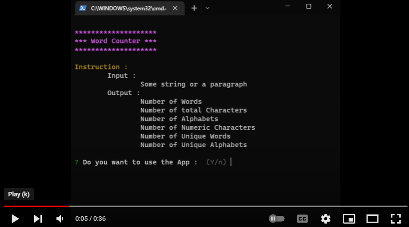

# Command Line Word Counter (TS)

A CLI based word counter using typescript and published as an executable npm package, complete problem statement is available [here](https://github.com/panaverse/typescript-node-projects/tree/main/project05_word_counter).

## NPM Package

### Usage

This project is published as an [npm package](https://www.npmjs.com/package/wmd-ts-word-counter). To use follow these steps.

- Install as an npm package

  ```cmd
  npm i wmd-ts-word-counter
  ```

- Run the app after installation

  ```cmd
  wmd-ts-word-counter
  ```

- Use the app as an npx package

  ```cmd
  npx wmd-ts-word-counter
  ```

### Instructions

- Inputs :

  - Enter any paragraph when prompted

- Results :
  - Number of Words
  - Number of total Characters
  - Number of Alphabets
  - Number of Numeric Characters
  - Number of Unique Words
  - Number of Unique Alphabets

## Demo

[](https://youtu.be/8AD0V1miKjs 'CLI Word Counter')

## Steps to code CLI word counter

All the details to code this app is given [here](https://github.com/hassan-ak/wmd-ts-word-counter/tree/main/stepsToCode/Readme.md).
